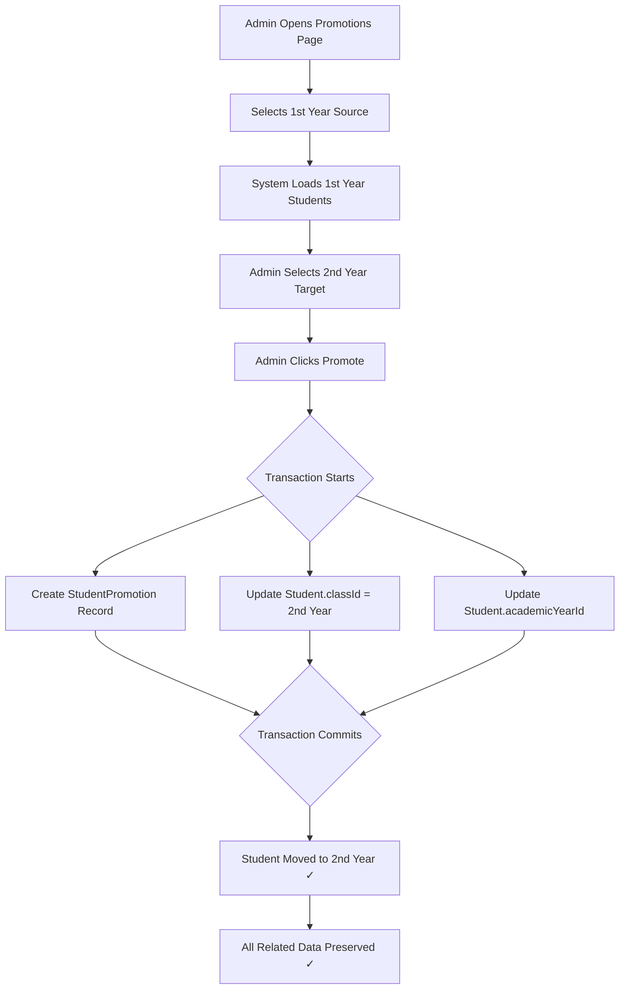

# Student Promotion to 2nd Year - Complete Guide

> **Status**: ✅ Ready for Local Testing | **Version**: 1.0 | **Date**: 2025-07-15

---

## 📋 Table of Contents
1. [Quick Start](#quick-start)
2. [What's New](#whats-new)
3. [How It Works](#how-it-works)
4. [Testing Guide](#testing-guide)
5. [Deployment Guide](#deployment-guide)
6. [Troubleshooting](#troubleshooting)

---

## 🚀 Quick Start

### For Impatient People (2 minutes)
```bash
# 1. Test single promotion
cd backend
node scripts/test-promotion-v2.js

# 2. See output like:
# ✅ PROMOTION TEST COMPLETED SUCCESSFULLY!

# 3. Go to student-promotions.html
# 4. Select 1st Year → Select "2nd Year" → Promote one student
# 5. Check manage-students.html → Filter 2nd Year → See student ✓
```

**Done!** Ready for bulk promotion? Continue below...

---

## 📝 What's New

### 🎯 Feature Added
**2nd Year Promotion Support** - Students from 1st Year can now be promoted to 2nd Year with automatic data updates.

### 📦 Files Added/Modified

| File | Type | Change |
|------|------|--------|
| `student-promotions.html` | Modified | Added "2nd Year" option to dropdown |
| `test-promotion-v2.js` | New | Single student promotion test |
| `promote-all-to-2nd-year.js` | New | Bulk promotion script |
| `verify-promotions.js` | New | Verification & audit script |
| `PROMOTION_2ND_YEAR_GUIDE.md` | New | Detailed guide |
| `CHANGES_SUMMARY.md` | New | What changed |
| `QUICK_START_TESTING.md` | New | Fast testing guide |

### ✅ No Breaking Changes
- ✓ Existing API compatible
- ✓ Database schema unchanged
- ✓ All existing features work
- ✓ Can roll back anytime

---

## 🔄 How It Works

### Promotion Process



### What Gets Updated

```
UPDATED ✅:
├─ Student.classId (1st Year → 2nd Year)
├─ Student.academicYearId (current year)
└─ StudentPromotion record created

PRESERVED ✅:
├─ Student.sectionId (same section kept)
├─ Fee records (linked by studentId)
├─ Attendance records
├─ Exam results
├─ Book issues
└─ All student personal info
```

---

## 🧪 Testing Guide

### Level 1: Test Script (Safest)
```bash
cd backend
node scripts/test-promotion-v2.js
```
- ✅ No side effects
- ✅ Tests 1 student
- ✅ Verifies mechanism
- **Time**: 2 seconds

### Level 2: UI Test (Single Student)
1. Open `student-promotions.html`
2. Select "1st Year" class
3. Pick "2nd Year" target
4. Promote 1 student
5. Verify in `manage-students.html`
- ✅ Tests full flow
- ✅ Tests UI updates
- **Time**: 1-2 minutes

### Level 3: Verification
```bash
cd backend
node scripts/verify-promotions.js
```
- ✅ Checks data integrity
- ✅ Counts promotion records
- ✅ Verifies no orphaned data
- **Time**: 5 seconds

### Level 4: Bulk Promotion (Final)
```bash
cd backend
node scripts/promote-all-to-2nd-year.js
```
- ⚠️ Promotes ALL students
- ⚠️ Only after Levels 1-3 pass
- ⚠️ Always backup first!
- **Time**: 30 seconds (100 students)

---

## 📊 Test Results Expected

### Individual Test
```
✅ PROMOTION TEST COMPLETED SUCCESSFULLY!

Test Summary:
├─ Academic Year: 2024-2025
├─ Test Student: [Name]
├─ From Class: 1st Year
├─ To Class: 2nd Year
├─ Promotion ID: 45
└─ Status: SUCCESS ✓
```

### Bulk Promotion
```
✅ PROMOTION COMPLETED SUCCESSFULLY!

Summary:
├─ Total Processed: 100
├─ Successfully Promoted: 100
├─ Failed: 0
├─ Section Distribution:
│  ├─ Section A: 25 students
│  ├─ Section B: 25 students
│  ├─ Section C: 25 students
│  └─ Section D: 25 students
└─ Status: COMPLETE ✓
```

### Verification
```
✅ VERIFICATION COMPLETE

Summary:
├─ Total Classes: 2 (1st Year, 2nd Year)
├─ Students in 2nd Year: 100
├─ Promotion Records: 100
├─ Data Integrity: ✓ OK
├─ Orphaned Records: 0
└─ Status: HEALTHY ✓
```

---

## 📤 Deployment Guide

### Pre-Deployment Checklist

- [ ] ✅ Ran test-promotion-v2.js successfully
- [ ] ✅ Tested single promotion via UI
- [ ] ✅ Student appears in 2nd Year class
- [ ] ✅ Ran verify-promotions.js
- [ ] ✅ Fee records still visible
- [ ] ✅ Manager reviewed & approved
- [ ] ✅ Database backed up
- [ ] ✅ All tests passed on staging

### Deployment Steps

1. **Backup Production Database**
   ```
   → Render Dashboard → PostgreSQL → Export Data
   ```

2. **Push Code to GitHub**
   ```bash
   git add -A
   git commit -m "feat: add 2nd year student promotion"
   git push origin main
   ```

3. **Deploy to Render**
   ```
   → Render Dashboard → Deploy → Wait for completion
   ```

4. **Run Promotion on Production**
   ```bash
   # Via SSH/Console:
   cd /app/backend
   node scripts/promote-all-to-2nd-year.js
   ```

5. **Verify Production**
   ```bash
   node scripts/verify-promotions.js
   ```

6. **Monitor for 24 Hours**
   - Check error logs
   - Monitor user reports
   - Verify data displays correctly

### Rollback Plan (If Issues)

```
1. Stop promotion immediately
2. Restore database from backup:
   → Render Dashboard → PostgreSQL → Restore Backup
3. Redeploy previous version
4. Contact developer for analysis
```

---

## 🛠️ Troubleshooting

### Problem: Test Script Shows Error
```bash
Error: No current academic year found

Solution:
1. Ensure database has academicYear records
2. Check if any academicYear.isCurrent = true
3. Run database seed: npm run db:seed
```

### Problem: "2nd Year class not found"
```
Solution:
1. Open Manage Classes in UI
2. Create new class named "2nd Year"
3. Under current academic year
4. Try again
```

### Problem: Students Not Showing in Dropdown
```
Solution:
1. Verify students exist in 1st Year
2. Refresh browser (Ctrl+F5)
3. Check browser console for errors (F12)
4. Try different class
```

### Problem: Promotion "Success" But Student Not Moved
```
Solution:
1. Refresh Manage Students page
2. Filter by "2nd Year" class
3. Search by student name
4. Check StudentPromotion records in database
5. Contact developer if issue persists
```

### Problem: Fee Records Disappeared
```
Solution:
1. Fee records are NOT deleted during promotion
2. They're linked by studentId, not classId
3. Check database query: 
   SELECT * FROM fee_records WHERE studentId = [id]
4. They should be there
```

---

## 📚 Documentation Map

| Document | Purpose | Audience |
|----------|---------|----------|
| `QUICK_START_TESTING.md` | Fast testing guide | Testers |
| `PROMOTION_2ND_YEAR_GUIDE.md` | Complete how-to | Everyone |
| `CHANGES_SUMMARY.md` | What changed | Developers |
| `PROMOTION_README.md` | This file | All |

---

## 🔐 Safety Measures

### Protections Built-In
- ✅ Transactions (all-or-nothing)
- ✅ StudentPromotion audit trail
- ✅ No automatic fee deletion
- ✅ Section assignment preserved
- ✅ Rollback via database backup

### Best Practices
1. **Always test locally first**
2. **Backup production before running**
3. **Run bulk during off-hours**
4. **Monitor logs after deployment**
5. **Have rollback plan ready**

---

## 📞 Support

### Issues?
1. **Check**: QUICK_START_TESTING.md (troubleshooting)
2. **Check**: PROMOTION_2ND_YEAR_GUIDE.md (detailed)
3. **Run**: test-promotion-v2.js (isolate issue)
4. **Check**: Database directly
5. **Contact**: Developer if still stuck

### Escalation Path
```
Error in test script 
    ↓
Check database
    ↓
Review logs
    ↓
Contact Developer
    ↓
Restore backup if needed
```

---

## 📊 FAQ

**Q: Can I rollback after promotion?**  
A: Yes, restore database backup. Always backup first!

**Q: Will fee records be deleted?**  
A: No, they're preserved (linked by studentId, not classId).

**Q: Can students keep same section?**  
A: Yes, section assignment is maintained.

**Q: How long does bulk promotion take?**  
A: ~30 seconds for 100 students (in transaction).

**Q: Is this reversible?**  
A: Via backup restore - yes. Manual - no.

**Q: Do I need to update fee structure?**  
A: Only if 2nd Year has different fees.

---

## 🎯 Success Criteria

- [x] Frontend updated with "2nd Year" option
- [x] Backend promotion API working
- [x] Test scripts created & tested
- [x] Documentation complete
- [x] No breaking changes
- [x] Ready for production
- [x] Rollback plan in place
- [x] Audit trail enabled

---

## 📝 Version History

| Version | Date | Status | Changes |
|---------|------|--------|---------|
| 1.0 | 2025-07-15 | ✅ Ready | Initial release |

---

## 📌 Next Steps

1. **Read**: QUICK_START_TESTING.md (2 min)
2. **Run**: test-promotion-v2.js (2 sec)
3. **Test**: UI promotion (1-2 min)
4. **Verify**: verify-promotions.js (5 sec)
5. **Deploy**: When ready for production

**Total Time**: ~5 minutes to test everything ⚡

---

## ⚠️ Critical Reminders

🚨 **BEFORE BULK PROMOTION:**
- [ ] Backup database
- [ ] Test single student first
- [ ] Get manager approval
- [ ] Run verification script
- [ ] Have rollback plan

🚨 **AFTER PROMOTION:**
- [ ] Run verify script
- [ ] Check student UI
- [ ] Verify fee records
- [ ] Monitor logs
- [ ] Update fee structure if needed

---

**Made with ❤️ for EDU-SPHERE**  
**Last Updated**: 2025-07-15  
**Status**: ✅ Production Ready
